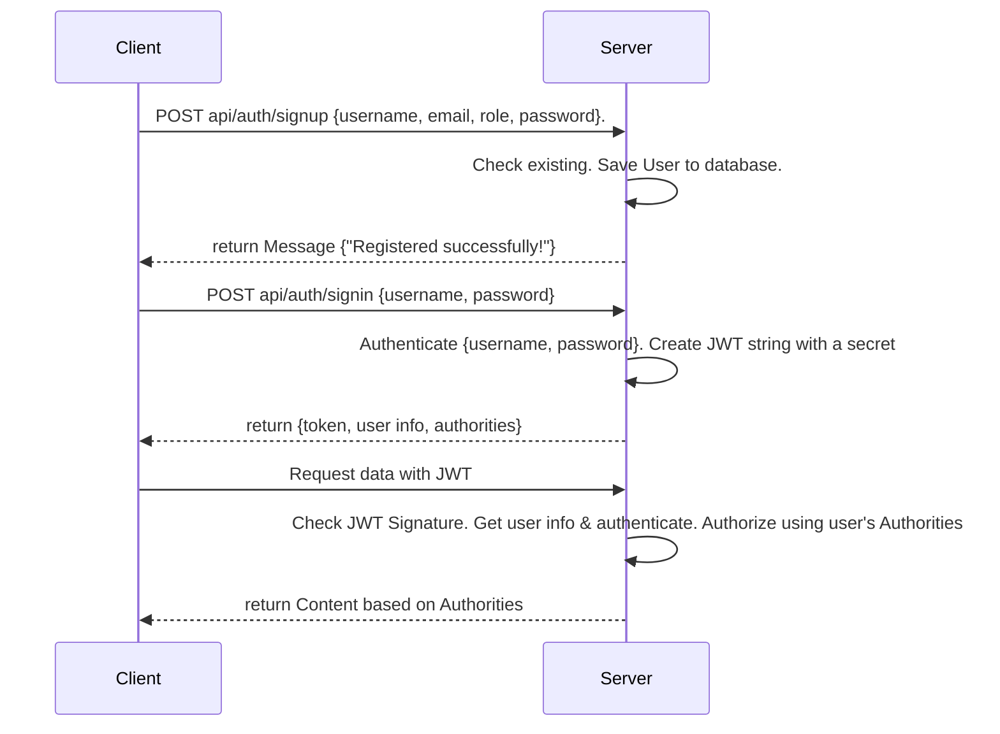
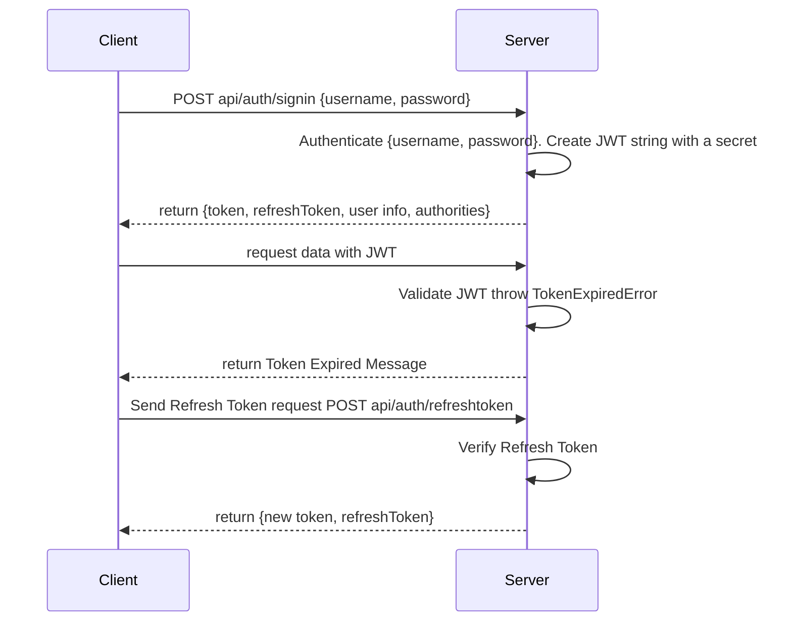

# starter-nodejs-typescript-prisma-jwt

## フォルダ構成

```sh
.
├── backend
│   ├── prisma
│   │   └── schema.prisma
│   ├── rest_client
│   │   ├── login.http
│   │   ├── logout.http
│   │   ├── signup.http
│   │   └── user.http
│   ├── src
│   │   ├── controllers
│   │   │   └── authController.ts
│   │   ├── middleware
│   │   │   └── authMiddleware.ts
│   │   ├── routes
│   │   │   └── authRoutes.ts
│   │   ├── utils
│   │   │   ├── db.ts
│   │   │   └── generateToken.ts
│   │   └── index.ts
│   ├── .env.template
│   ├── .gitignore
│   ├── package-lock.json
│   ├── package.json
│   └── tsconfig.json
├── mysql
│   └── conf.d
│       └── my.cnf
├── .env.template
├── .gitignore
├── docker-compose.yml
└── README.md
```

## 環境構築

1. .env.template をコピーして、適当に書き換える
   `cp .env.template .env`
2. docker を起動
   `docker-compose up -d`
3. backend コンテナ内に入る
   `docker-compose exec backend /bin/bash`
4. /app に移動
   `cd /app`
5. .env.template をコピーして、適当に書き換える
   `cp .env.template .env`
6. ライブラリインストール
   `npm install`
7. マイグレーション実行
   `npx prisma migrate dev --name init`
8. express 起動
   `npm start`

## 動作確認

vscode の拡張機能の「REST Client」をインストールし、backend/rest_client/のファイルを実行する

## JWT 認証フロー

### JWT 認証のサインアップとログインのフロー



### トークンの有効期限切れによる再発行のフロー


