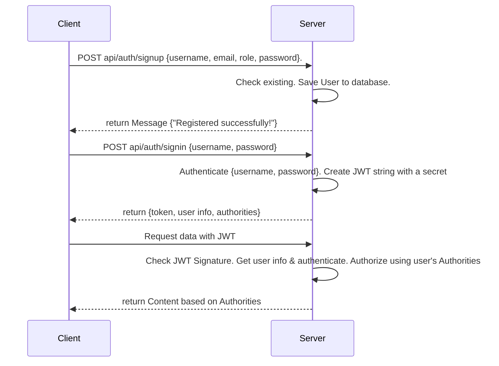
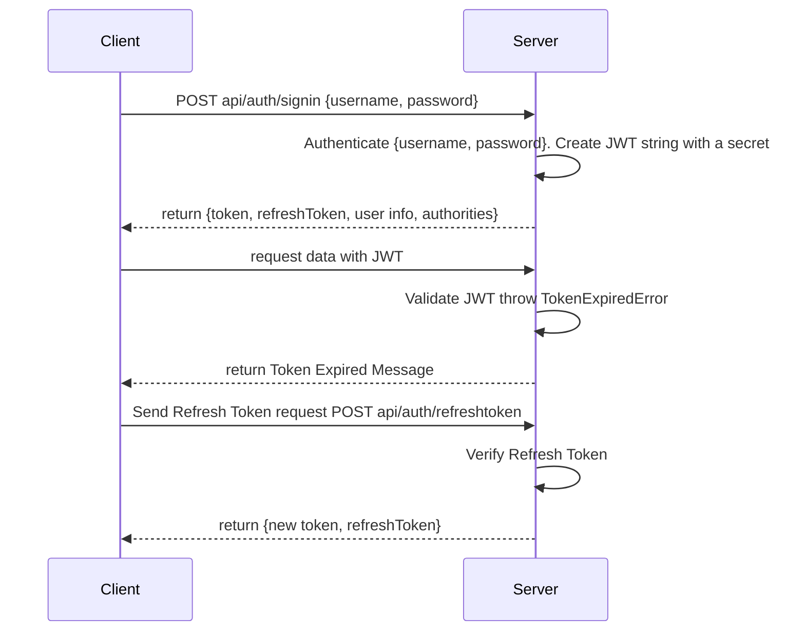

# starter-nodejs-typescript-prisma-jwt

## 環境構築

1. .env.template をコピーして、適当に書き換える
   `cp .env.template .env`
2. docker を起動
   `docker-compose up -d`
3. backend コンテナ内に入る
   `docker-compose exec backend /bin/bash`
4. .env.template をコピーして、適当に書き換える
   `cp .env.template .env`
5. ライブラリインストール
   `npm install`
6. マイグレーション実行
   `npx prisma migrate dev --name init`
7. express 起動
   `npm start`

## 動作確認

vscode の拡張機能の「REST Client」をインストールし、backend/rest_client/のファイルを実行する

## JWT 認証フロー

### JWT 認証のサインアップとログインのフロー

### トークンの有効期限切れによる再発行のフロー

